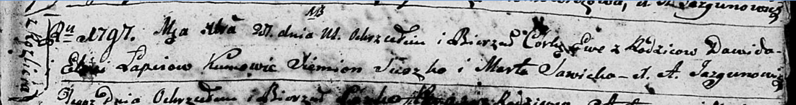

**Лапец Елеся (Łapciowa Elesia)**

1 октября 1788 -- крещение дочери Текли (НИАБ 136-13-894, лист 5,
№50/1788-р (ориг)).

25 июля 1792 -- крещение сына Габриэля (НИАБ 136-13-894, лист 16об,
№43/1782-р (ориг)).

27 декабря 1797 г -- крещение (НИАБ 136-13-894, лист 35, №69/1797-р
(ориг)), (РГИА 823-2-18, лист 261об, №50/1797-р (коп)).

**НИАБ 136-13-894:** Лист 5. **Метрическая запись №50/1788-р (ориг).**

{width="6.496527777777778in"
height="0.7429199475065617in"}

Дедиловичская Покровская церковь. 1 октября 1788 года. Метрическая
запись о крещении.

Łapciowna Tekla -- дочь родителей с деревни Разлитье.

Łapać Dawid -- отец.

Łapciowa Elesia -- мать.

Suszko Siemion - кум.

Suszkowa Marta - кума.

Jazgunowicz Antoni -- ксёндз.

**НИАБ 136-13-894:** Лист 16об. **Метрическая запись №43/1792-р
(ориг).**

{width="6.496527777777778in"
height="0.7637062554680665in"}

Дедиловичская Покровская церковь. 25 июля 1792 года. Метрическая запись
о крещении.

Łapać Gabryel -- сын родителей с деревни Разлитье.

Łapać Dawid -- отец.

Łapciowa Elesia -- мать.

Suszko Siemion - кум.

Sawicka Marta - кума.

Jazgunowicz Antoni -- ксёндз.

**НИАБ 136-13-894:** Лист 35. **Метрическая запись №69/1797-р (ориг).**

{width="6.496527777777778in"
height="0.8602580927384077in"}

Дедиловичская Покровская церковь. 27 декабря 1797 года. Метрическая
запись о крещении.

Łapciowna Ewa -- дочь родителей с деревни Разлитье.

Łapać Dawid -- отец.

Łapciowa Elesia -- мать.

Suszko Siemion - кум.

Sawicka Marta - кума.

Jazgunowicz Antoni -- ксёндз.

**РГИА 823-2-18:** Лист 261об. **Метрическая запись №50/1797-р (коп).**

{width="6.496527777777778in"
height="1.5368055555555555in"}

Дедиловичская Покровская церковь. 27 декабря 1797 года. Метрическая
запись о крещении.

Łapciowna Ewa -- дочь родителей с деревни Разлитье.

Łapiec Dawid -- отец.

Łapciowa Elesia -- мать.

Suszko Siemion -- кум.

Sawicka Marta -- кума.

Jazgunowicz Antoni -- ксёндз.
