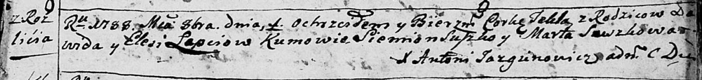
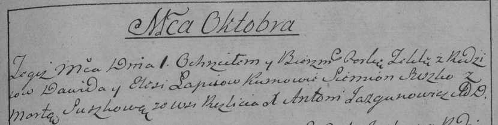

**Лапец Текля Давидова (Łapciowna Tekla)**

1 октября 1788 г -- крещение (НИАБ 136-13-894, лист 5, №50/1788-р
(ориг)), (РГИА 823-2-18, лист 236об, №27/1788-р (коп)).

**НИАБ 136-13-894:** Лист 5. **Метрическая запись №50/1788-р (ориг).**

Дедиловичская Покровская церковь. 1 октября 1788 года. Метрическая
запись о крещении.

Łapciowna Tekla -- дочь родителей с деревни Разлитье.

Łapać Dawid -- отец.

Łapciowa Elesia -- мать.

Suszko Siemion - кум.

Suszkowa Marta - кума.

Jazgunowicz Antoni -- ксёндз.

**РГИА 823-2-18:** Лист 237. **Метрическая запись №27/1788-р (коп).**

Дедиловичская Покровская церковь. 1 октября 1788 года. Метрическая
запись о крещении.

Łapciewna Tekla -- дочь родителей с деревни Разлитье.

Łapiec Dawid -- отец.

Łapciewa Elesia -- мать.

Suszko Siemion -- кум.

Suszkowa Marta - кума.

Jazgunowicz Antoni -- ксёндз.
