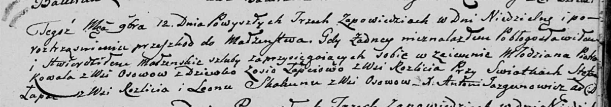

**Коваль (Лапец) Зося (Kowalowa Zosia z Łapciow)**

12 ноября 1804 г -- венчание с молодым Петром Ковалём с деревни Осово
(НИАБ 136-13-920, лист 11, №12/1804-б (коп)).

**НИАБ 136-13-920:** Лист 11. **Метрическая запись №12/1804-б (ориг).**

{width="6.496527777777778in"
height="1.1385181539807525in"}

Дедиловичская Покровская церковь. 12 ноября 1804 года. Метрическая
запись о венчании.

Kowal Piotr -- жених, молодой, с деревни Осовo.

Łapciowa Zosia -- невеста, девка, с деревни Разлитье.

Łapac Stefan -- свидетель, с деревни Разлитье.

Skakun Leon -- свидетель, с деревни Осовo.

Jazgunowicz Antoni -- ксёндз.
