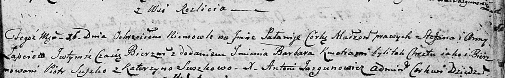

**Лапец Паланея Степанова (Łapciewna Pałanieja Barbara)**

16 октября 1804 -- крещение (НИАБ 136-13-894, лист 55, №47/1804-р
(ориг)).

**НИАБ 136-13-894:** Лист 55. **Метрическая запись №47/1804-р (ориг).**

Дедиловичская Покровская церковь. 16 октября 1804 года. Метрическая
запись о крещении.

Łapciowna Pałanieja Barbara -- дочь родителей с деревни Разлитье.

Łapać Stefan -- отец.

Łapciowa Anna -- мать.

Suszko Piotr -- кум.

Suszkowa Katerzyna -- кума.

Jazgunowicz Antoni -- ксёндз.
