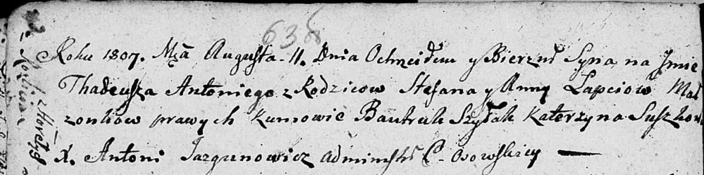

**Лапец Тадей Степанов (Łapać Tadeusz Antoni)**

11 августа 1807 г -- крещение (НИАБ 136-13-894, лист 63об, №37/1807-р
(ориг)).

**НИАБ 136-13-894:** Лист 63об. **Метрическая запись №37/1807-р
(ориг).**

{width="6.496527777777778in"
height="1.6192705599300088in"}

Дедиловичская Покровская церковь. 11 августа 1807 года. Метрическая
запись о крещении.

Łapać Thadeusz Antoni -- сын родителей с деревни Разлитье.

Łapać Stefan -- отец.

Łapciowa Anna -- мать.

Szyłak Bautruk -- кум, с деревни Горелое.

Suszkowa Katerzyna -- кума, с деревни Горелое.

Jazgunowicz Antoni -- ксёндз.
