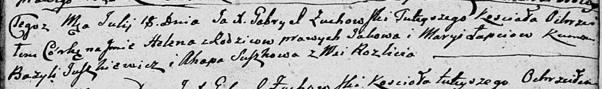

**Лапец Гелена Яковова (Łapciowna Helena)**

18 июля 1809 г -- крещение (НИАБ 136-13-894, лист 75, №34/1809-р
(ориг)).

**НИАБ 136-13-894:** Лист 75. **Метрическая запись №34/1809-р (ориг).**

{width="6.496527777777778in"
height="0.9615048118985127in"}

Дедиловичская Покровская церковь. 18 июля 1809 года. Метрическая запись
о крещении.

Łapciowna Helena -- дочь родителей с деревни Разлитье.

Łapać Jakow -- отец.

Łapciowa Marya -- мать.

Juszkiewicz Bazyli -- кум.

Suszkowa Ahapa -- кума.

Zuchowski Gabryel -- ксёндз.
