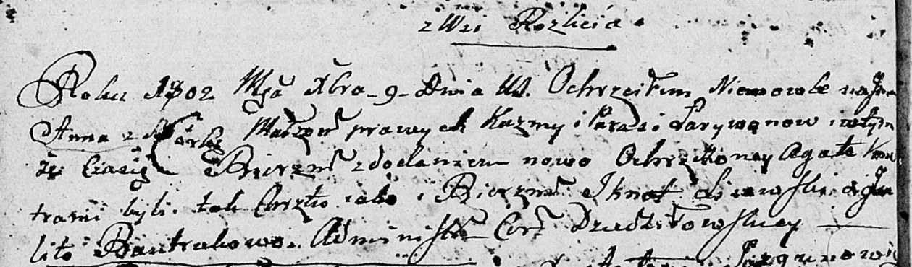

**Ларывон Парася (Łarywonowa Parasia)**

9 декабря 1802 г -- крещение дочери Анны Агаты (НИАБ 136-13-894, лист
48об, №44/1802-р (ориг)).

**НИАБ 136-13-894:** Лист 48об. **Метрическая запись №44/1802-р
(ориг).**

{width="6.496527777777778in"
height="1.9089293525809274in"}

Дедиловичская Покровская церковь. 9 декабря 1802 года. Метрическая
запись о крещении.

Łarywonowna Anna Agata -- дочь родителей с деревни Разлитье.

Łarywon Kuzma -- отец.

Łarywonowa Parasia -- мать.

Lisowski Jgnat -- кум.

Bautrukowa Julita? -- кума.

Jazgunowicz Antoni -- ксёндз.
