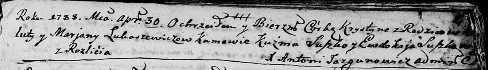
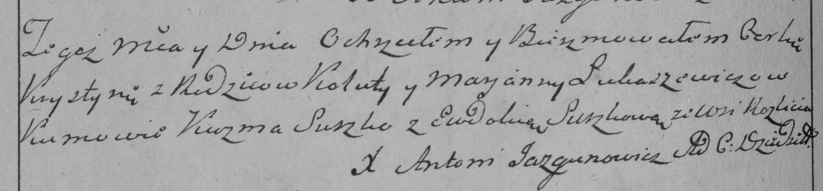
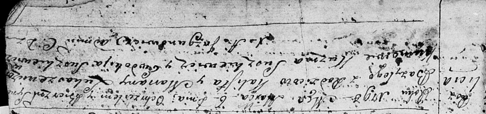

**Лукашевич Марьяна (Łukaszewiczowa Marjana)**

30 апреля 1788 г -- крещение дочери Хрыстыны (НИАБ 136-13-894, лист 4,
№13/1788-р (ориг)), (РГИА 823-2-18, лист 235об, №4/1788-р (коп)).

6 марта 1793 г -- крещение сына Базыля (НИАБ 136-13-894, лист 19,
№30/1793-р (ориг)).

**НИАБ 136-13-894:** Лист 4. **Метрическая запись №13/1788-р (ориг).**

Дедиловичская Покровская церковь. 30 апреля 1788 года. Метрическая
запись о крещении.

Łukaszewiczowna Krystyna -- дочь родителей с деревни Разлитье.

Łukaszewicz Kaluta -- отец.

Łukaszewiczowa Marjana -- мать.

Suszko Kuźma - кум.

Suszkowa Ewdokija - кума.

Jazgunowicz Antoniusz -- ксёндз.

**РГИА 823-2-18:** Лист 235об. **Метрическая запись №4/1788-р (коп).**

Дедиловичская Покровская церковь. 30 января 1788 года. Метрическая
запись о крещении.

Łukaszewiczowna Krystyna -- дочь родителей с деревни Разлитье.

Łukaszewicz Kaluta -- отец.

Łukaszewiczowa Marjanna -- мать.

Suszko Kuzma -- кум.

Suszkowa Eudokia - кума.

Jazgunowicz Antoni -- ксёндз.

**НИАБ 136-13-894:** Лист 19. **Метрическая запись №30/1793-р (ориг).**

Дедиловичская Покровская церковь. 6 марта 1793 года. Метрическая запись
о крещении.

Łukaszewicz Bazyli -- сын родителей с деревни Разлитье.

Łukaszewicz Kalist -- отец.

Łukaszewicz Marjana -- мать.

Suszkiewicz Kuźma - кум.

Suszkiewiczowa Ewdokija - кума.

Jazgunowicz Antoni -- ксёндз.
