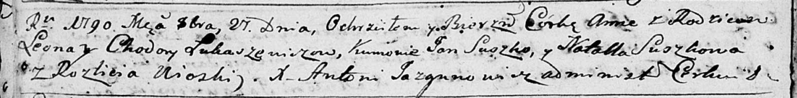

**Лукашевич Анна Леонова (Łukaszewiczowna Anna)**

21 октября 1790 г -- крещение (НИАБ 136-13-894, лист 11об, №72/1790-р
(ориг)).

**НИАБ 136-13-894:** Лист 11об. **Метрическая запись №72/1790-р
(ориг).**

Дедиловичская Покровская церковь. 21 октября 1790 года. Метрическая
запись о крещении.

Łukaszewiczowna Anna -- дочь родителей с деревни Разлитье.

Łukaszewicz Leon -- отец.

Łukaszewiczowa Chodora -- мать.

Suszko Jan - кум.

Suszkowa Natalla - кума.

Jazgunowicz Antoni -- ксёндз.
