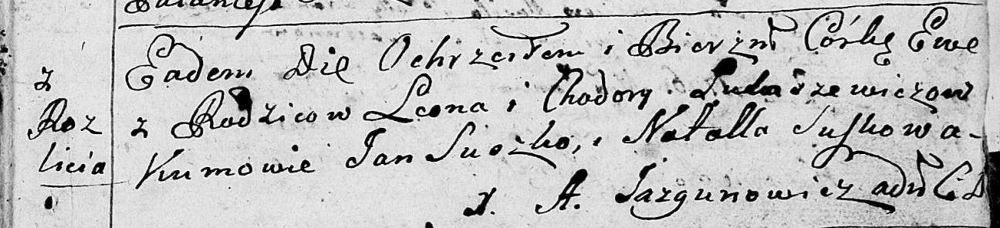
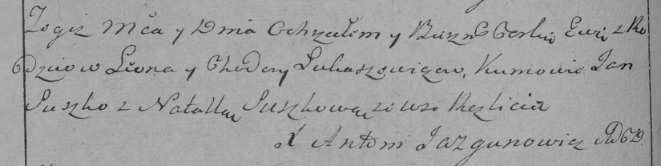

**Лукашевич Ева Леонова (Łukaszewiczowna Ewa)**

1 января 1796 г -- крещение дочери Евы (НИАБ 136-13-894, лист 27,
№2/1796-р (ориг)), (РГИА 823-2-18, лист 254об, №1/1796-р (коп)).

**НИАБ 136-13-894:** Лист 27. **Метрическая запись №2/1796-р (ориг).**

Дедиловичская Покровская церковь. 1 января 1796 года. Метрическая запись
о крещении.

Łukaszewiczowna Ewa -- дочь родителей с деревни Разлитье.

Łukaszewicz Leon -- отец.

Łukaszewiczowa Chodora -- мать.

Suszko Jan - кум.

Suszkowa Natalla - кума.

Jazgunowicz Antoni -- ксёндз.

**РГИА 823-2-18:** Лист 254об. **Метрическая запись №2/1796-р (коп).**

Дедиловичская Покровская церковь. 1 января 1796 года. Метрическая запись
о крещении.

Łukaszewiczowna Ewa -- дочь родителей с деревни Разлитье.

Łukaszewicz Leon -- отец.

Łukaszewiczowa Chodora -- мать.

Suszko Jan -- кум.

Suszkowa Natalla -- кума.

Jazgunowicz Antoni -- ксёндз.
