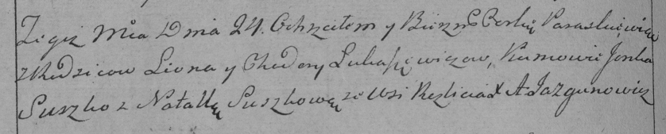

**Лукашевич Параскевия Леонова (Łukaszewiczowna Paraskiewija)**

24 октября 1792 г -- крещение (НИАБ 136-13-894, лист 17, №67/1792-р
(ориг)), (РГИА 823-2-18, лист 245, №31/1792-р (коп)).

**НИАБ 136-13-894:** Лист 17. **Метрическая запись №67/1792-р (ориг).**

{width="6.496527777777778in"
height="1.1800896762904638in"}

Дедиловичская Покровская церковь. 24 октября 1792 года. Метрическая
запись о крещении.

Łukaszewiczowa Paraskiewija -- дочь родителей с деревни Разлитье.

Łukaszewicz Leon -- отец.

Łukaszewiczowa Chodora -- мать.

Suszko Janka - кум.

Suszkowa Natalla - кума.

Jazgunowicz Antoni -- ксёндз.

**РГИА 823-2-18:** Лист 245об. **Метрическая запись №31/1792-р (коп).**

{width="6.496527777777778in"
height="1.3104166666666666in"}

Дедиловичская Покровская церковь. 24 октября 1792 года. Метрическая
запись о крещении.

Łukaszewiczowna Paraskiewia -- дочь родителей с деревни Разлитье.

Łukaszewicz Leon -- отец.

Łukaszewiczowa Chodora -- мать.

Suszko Janka -- кум.

Suszkowa Natalla -- кума.

Jazgunowicz Antoni -- ксёндз.
