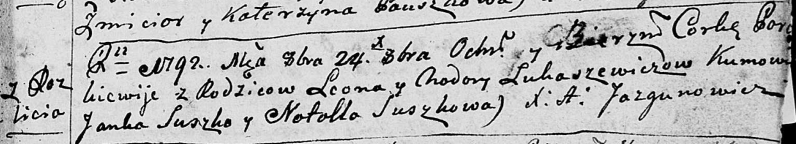

**Лукашевич (Скакун) Ходора (Łukaszewiczowa Chodora, Chwiedora z
Skakunow)**

20 января 1789 г -- венчание с Леоном Лукашевичем (НИАБ 136-13-894, лист
67об, №2/1789-б (ориг)).

21 октября 1790 г -- крещение дочери Анны (НИАБ 136-13-894, лист 11об,
№72/1790-р (ориг)).

24 октября 1792 г -- крещение дочери Параскевии (НИАБ 136-13-894, лист
17, №67/1792-р (ориг)), (РГИА 823-2-18, лист 245, №31/1792-р (коп)).

1 января 1796 г -- крещение дочери Евы (НИАБ 136-13-894, лист 27,
№2/1796-р (ориг)), (РГИА 823-2-18, лист 254об, №1/1796-р (коп)).

27 сентября 1797 г -- крещение дочери Текли (НИАБ 136-13-894, лист 34об,
№56/1797-р (ориг)), (РГИА 823-2-18, лист 260об, №37/1797-р (коп)).

6 октября 1803 г -- крещение сына Якуба Лукаша (НИАБ 136-13-894, лист
52, №42/1803-р (ориг)).

27 ноября 1805 г -- крещение дочери Катерыны Елены (НИАБ 136-13-894,
лист 58, №58/1805-р (ориг)).

13 июня 1809 г -- крещение сына Юстына (НИАБ 136-13-894, лист 74об,
№28/1809-р (ориг)).

**НИАБ 136-13-894:** Лист 67об. **Метрическая запись №2/1789-б (ориг).**

{width="6.496527777777778in"
height="0.887749343832021in"}

Дедиловичская Покровская церковь. 20 января 1789 года. Метрическая
запись о венчании.

Łukaszewicz Leon -- жених, с деревни Разлитье.

Skakunowna Chodora -- невеста.

Suszko Łukjan -- свидетель.

Każamiaka Eusefi -- свидетель.

Jazgunowicz Antoni -- ксёндз.

**НИАБ 136-13-894:** Лист 11об. **Метрическая запись №72/1790-р
(ориг).**

{width="6.496527777777778in"
height="0.8052766841644794in"}

Дедиловичская Покровская церковь. 21 октября 1790 года. Метрическая
запись о крещении.

Łukaszewiczowna Anna -- дочь родителей с деревни Разлитье.

Łukaszewicz Leon -- отец.

Łukaszewiczowa Chodora -- мать.

Suszko Jan - кум.

Suszkowa Natalla - кума.

Jazgunowicz Antoni -- ксёндз.

**НИАБ 136-13-894:** Лист 17. **Метрическая запись №67/1792-р (ориг).**

{width="6.496527777777778in"
height="1.1800896762904638in"}

Дедиловичская Покровская церковь. 24 октября 1792 года. Метрическая
запись о крещении.

Łukaszewiczowa Paraskiewija -- дочь родителей с деревни Разлитье.

Łukaszewicz Leon -- отец.

Łukaszewiczowa Chodora -- мать.

Suszko Janka - кум.

Suszkowa Natalla - кума.

Jazgunowicz Antoni -- ксёндз.

**РГИА 823-2-18:** Лист 245об. **Метрическая запись №31/1792-р (коп).**

{width="6.496527777777778in"
height="1.3104166666666666in"}

Дедиловичская Покровская церковь. 24 октября 1792 года. Метрическая
запись о крещении.

Łukaszewiczowna Paraskiewia -- дочь родителей с деревни Разлитье.

Łukaszewicz Leon -- отец.

Łukaszewiczowa Chodora -- мать.

Suszko Janka -- кум.

Suszkowa Natalla -- кума.

Jazgunowicz Antoni -- ксёндз.

**НИАБ 136-13-894:** Лист 27. **Метрическая запись №2/1796-р (ориг).**

{width="6.496527777777778in"
height="1.4838287401574803in"}

Дедиловичская Покровская церковь. 1 января 1796 года. Метрическая запись
о крещении.

Łukaszewiczowna Ewa -- дочь родителей с деревни Разлитье.

Łukaszewicz Leon -- отец.

Łukaszewiczowa Chodora -- мать.

Suszko Jan - кум.

Suszkowa Natalla - кума.

Jazgunowicz Antoni -- ксёндз.

**РГИА 823-2-18:** Лист 254об. **Метрическая запись №2/1796-р (коп).**

{width="6.496527777777778in"
height="1.6298611111111112in"}

Дедиловичская Покровская церковь. 1 января 1796 года. Метрическая запись
о крещении.

Łukaszewiczowna Ewa -- дочь родителей с деревни Разлитье.

Łukaszewicz Leon -- отец.

Łukaszewiczowa Chodora -- мать.

Suszko Jan -- кум.

Suszkowa Natalla -- кума.

Jazgunowicz Antoni -- ксёндз.

**НИАБ 136-13-894:** Лист 34об. **Метрическая запись №56/1797-р
(ориг).**

{width="6.496527777777778in"
height="1.402697944006999in"}

Дедиловичская Покровская церковь. 27 сентября 1797 года. Метрическая
запись о крещении.

Łukaszewiczowna Tekla -- дочь родителей с деревни Разлитье.

Łukaszewicz Leon -- отец.

Łukaszewiczowa Chodora -- мать.

Suszko Siemion - кум.

Suszkowa Natalla - кума.

Jazgunowicz Antoni -- ксёндз.

**РГИА 823-2-18:** Лист 260об. **Метрическая запись №37/1797-р (коп).**

{width="6.496527777777778in"
height="2.178472222222222in"}

Дедиловичская Покровская церковь. 27 августа 1797 года. Метрическая
запись о крещении.

Łukaszewiczowna Tekla -- дочь родителей с деревни Разлитье.

Łukaszewicz Leon -- отец.

Łukaszewiczowa Chodora -- мать.

Suszko Siemion -- кум.

Suszkowa Natalla -- кума.

Jazgunowicz Antoni -- ксёндз.

**НИАБ 136-13-894:** Лист 52. **Метрическая запись №42/1803-р (ориг).**

{width="6.496527777777778in"
height="1.7144827209098863in"}

Дедиловичская Покровская церковь. 6 октября 1803 года. Метрическая
запись о крещении.

Łukaszewicz Jakub Łukasz -- сын родителей с деревни Разлитье.

Łukaszewicz Leon -- отец.

Łukaszewiczowa Chodora -- мать.

Suszko Elisiey -- кум.

Suszkowa Natalla -- кума.

Jazgunowicz Antoni -- ксёндз.

**НИАБ 136-13-894:** Лист 58. **Метрическая запись №58/1805-р (ориг).**

{width="6.496527777777778in"
height="0.9729035433070866in"}

Дедиловичская Покровская церковь. 27 ноября 1805 года. Метрическая
запись о крещении.

Łukaszewiczowna Katarzyna Elena -- дочь родителей с деревни Разлитье.

Łukaszewicz Leon -- отец.

Łukaszewiczowa Chwiedora -- мать.

Suszko Jan -- кум.

Suszkowa Natalia -- кума.

Jazgunowicz Antoni -- ксёндз.

**НИАБ 136-13-894:** Лист 74об. **Метрическая запись №28/1809-р
(ориг).**

{width="6.496527777777778in"
height="0.872998687664042in"}

Дедиловичская Покровская церковь. 13 июня 1809 года. Метрическая запись
о крещении.

Łukaszewicz Justyn -- сын родителей с деревни Разлитье.

Łukaszewicz Leon -- отец.

Łukaszewiczowa Chodora -- мать.

Suszko Samuś -- кум.

Suszkowa Ahapa -- кума.

Jazgunowicz Antoni -- ксёндз.
