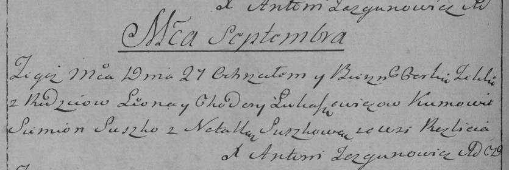

**Лукашевич Юстын Леонов (Łukaszewicz Justyn)**

13 июня 1809 г -- крещение (НИАБ 136-13-894, лист 74об, №28/1809-р
(ориг)).

**НИАБ 136-13-894:** Лист 74об. **Метрическая запись №28/1809-р
(ориг).**

{width="6.496527777777778in"
height="0.872998687664042in"}

Дедиловичская Покровская церковь. 13 июня 1809 года. Метрическая запись
о крещении.

Łukaszewicz Justyn -- сын родителей с деревни Разлитье.

Łukaszewicz Leon -- отец.

Łukaszewiczowa Chodora -- мать.

Suszko Samuś -- кум.

Suszkowa Ahapa -- кума.

Jazgunowicz Antoni -- ксёндз.
