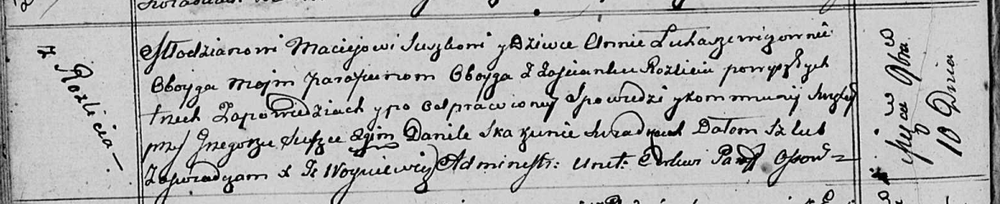

**Сушко (в девичестве Лукашевич) Анна (Suszkowa Anna z Łukaszewiczow)**

10 ноября 1812 г -- венчание с молодым Мацеем Сушко с деревни Разлитье
(НИАБ 136-13-920, лист 18об, №5/1812-б (ориг)).

**НИАБ 136-13-920:** Лист 18об. **Метрическая запись №5/1812-б (ориг).**

Осовская Покровская церковь. 10 ноября 1812 года. Запись о венчании.

Suszko Maciey -- жених, молодой, парафии Осовской, с деревни Разлитье.

Łukaszewiczowna Anna -- невеста, девка, парафии Осовской, с деревни
Разлитье.

Suszko Grzegorz -- свидетель.

Skakun Daniła -- свидетель.

Woyniewicz Tomasz -- ксёндз.
