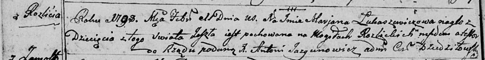

**Лукашевич Марьяна (Łukaszewiczowa Marjana)**

11 февраля 1798 г -- отпевание (НИАБ 136-13-919, лист 7об, №3/1798-у
(ориг)).

**НИАБ 136-13-919:** Лист 7об. **Метрическая запись №3/1798-у (ориг).**

{width="6.496527777777778in"
height="0.8152777777777778in"}

Дедиловичская Покровская церковь. 11 февраля 1798 года. Метрическая
запись об отпевании.

Łukaszewiczowa Marjana -- умершая, с деревни Разлитье, похоронена на
кладбище деревни Разлитье.

Jazgunowicz Antoni -- ксёндз.
