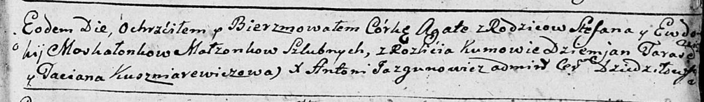

**Москалёнок Агата Степанова (Moskałonkowna Agata)**

9 ноября 1790 г -- крещение (НИАБ 136-13-894, лист 12, №84/1790-р
(ориг)).

**НИАБ 136-13-894:** Лист 12. **Метрическая запись №84/1790-р (ориг).**

Дедиловичская Покровская церковь. 9 ноября 1790 года. Метрическая запись
о крещении.

Moskałonkowna Agata -- дочь родителей с деревни Разлитье.

Moskałonak Stefan -- отец.

Moskałonkowa Ewdokia -- мать.

Tarasewicz Dzemjan - кум.

Kuszniarewiczowa Taciana - кума.

Jazgunowicz Antoni -- ксёндз.
