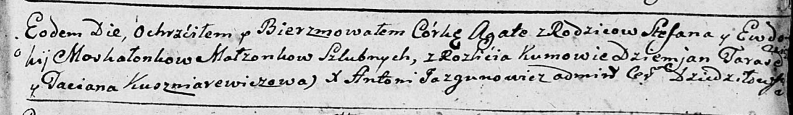
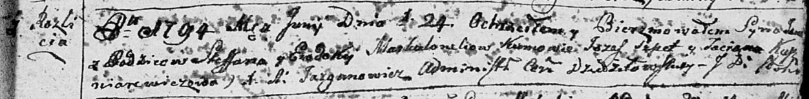
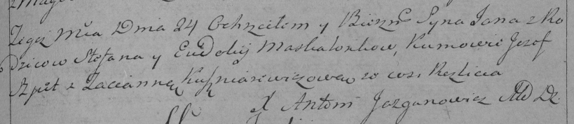

**Москалёнок Евдокия (Moskałonkowa Ewdokia)**

15 августа 1784 г -- крещение дочери Крыстыны (РГИА 623-2-18, лист 227,
№17/1784-р (коп)).

9 ноября 1790 г -- крещение дочери Агаты (НИАБ 136-13-894, лист 12,
№84/1790-р (ориг)).

24 июня 1794 г -- крещение сына Яна (НИАБ 136-13-894, лист 22,
№25/1794-р (ориг)), (РГИА 823-2-18, лист 250, №16/1794-р (коп)).

**РГИА 823-2-18:** Лист 227. **Метрическая запись №17/1784-р (коп).**

Дедиловичская Покровская церковь. 15 августа 1784 года. Метрическая
запись о крещении.

Maskalonkowna Krystyna -- дочь родителей с деревни Разлитье.

Maskalonek Sciepan -- отец.

Maskalonkowa Ewdokija -- мать.

Tarasewicz Mikita -- кум.

Szuszkowna Tacianna - кума.

Jazgunowicz Antoni -- ксёндз.

**НИАБ 136-13-894:** Лист 12. **Метрическая запись №84/1790-р (ориг).**

Дедиловичская Покровская церковь. 9 ноября 1790 года. Метрическая запись
о крещении.

Moskałonkowna Agata -- дочь родителей с деревни Разлитье.

Moskałonak Stefan -- отец.

Moskałonkowa Ewdokia -- мать.

Tarasewicz Dzemjan - кум.

Kuszniarewiczowa Taciana - кума.

Jazgunowicz Antoni -- ксёндз.

**НИАБ 136-13-894:** Лист 22. **Метрическая запись №25/1794-р (ориг).**

Дедиловичская Покровская церковь. 24 июня 1794 года. Метрическая запись
о крещении.

Moskalonek Jan -- сын родителей с деревни Разлитье.

Moskalonek Stefan -- отец.

Moskalonkowa Ewdokija -- мать.

Szpet Jozef - кум.

Kuszniarewiczowa Taciana - кума.

Jazgunowicz Antoni -- ксёндз.

**РГИА 823-2-18:** Лист 250. **Метрическая запись №16/1794-р (коп).**

Дедиловичская Покровская церковь. 24 июня 1794 года. Метрическая запись
о крещении.

Maskalionek Jan -- сын родителей с деревни Разлитье.

Maskalionek Stefan -- отец.

Maskalionkowa Eudokija -- мать.

Szpet Jozef -- кум.

Kuszniarewiczowa Tacianna -- кума.

Jazgunowicz Antoni -- ксёндз.
