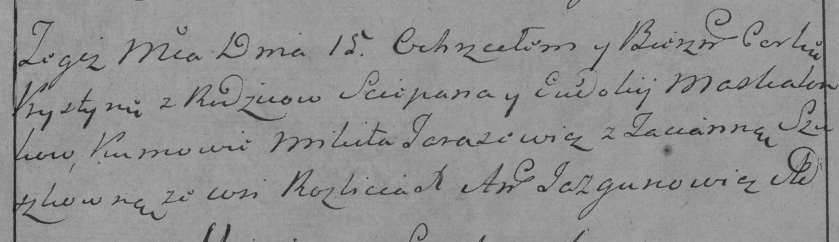

**Москалёнок Крыстына Степанова (Moskałonkowna Krystyna)**

15 августа 1784 г -- крещение (РГИА 623-2-18, лист 227, №17/1784-р
(коп)).

**РГИА 823-2-18:** Лист 227. **Метрическая запись №17/1784-р (коп).**

{width="6.496527777777778in"
height="1.8736111111111111in"}

Дедиловичская Покровская церковь. 15 августа 1784 года. Метрическая
запись о крещении.

Maskalonkowna Krystyna -- дочь родителей с деревни Разлитье.

Maskalonek Sciepan -- отец.

Maskalonkowa Ewdokija -- мать.

Tarasewicz Mikita -- кум.

Szuszkowna Tacianna - кума.

Jazgunowicz Antoni -- ксёндз.
