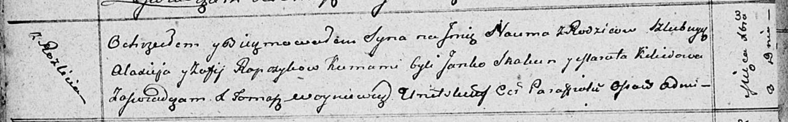

**Рабчык София (Rabczykowa Zofija)**

8 декабря 1811 -- крещение сына Наума (НИАБ 136-13-894, лист 82об,
№60/1811-р (ориг)).

**НИАБ 136-13-894:** Лист 82об. **Метрическая запись №60/1811-р
(ориг).**

Осовская Покровская церковь. 8 декабря 1811 года. Метрическая запись о
крещении.

Rapczyk Naum -- сын родителей с деревни Разлитье.

Rapczyk Alaxiey -- отец.

Rapczykowa Zofija -- мать.

Skakun Janka -- кум.

Kikiłowa Maruta -- кума.

Woyniewicz Tomasz -- ксёндз.
