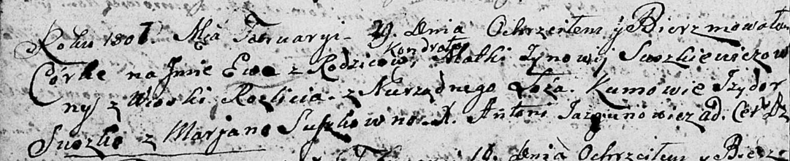

**Сушкевич Кондрат (Suszkiewicz Kondrat)**

29 января 1807 г -- крещение дочери Евы (НИАБ 136-13-894, лист 61об,
№5/1807-р (ориг)).

**НИАБ 136-13-894:** Лист 61об. **Метрическая запись №5/1807-р (ориг).**

{width="6.496527777777778in"
height="1.3296128608923885in"}

Дедиловичская Покровская церковь. 29 января 1807 года. Метрическая
запись о крещении.

Suszkiewiczowa Ewa -- дочь невенчаных родителей с деревни Разлитье.

Suszkiewicz Kondrat -- отец.

Suszkiewiczowa Zynowija -- мать.

Suszko Jzydor -- кум.

Suszkowna Marjana -- кума.

Jazgunowicz Antoni -- ксёндз.
