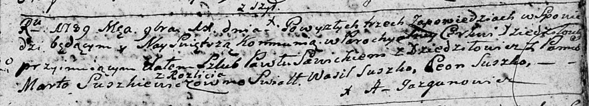

**Сушкевич (Савицкая) Марта (Sawicka Marta z Suszkiewiczow)**

11 ноября 1789 г -- венчание с Павлом Савицким с деревни Дедиловичи
(НИАБ 136-13-894, лист 68, №13/1789-р (ориг)).

**НИАБ 136-13-894:** Лист 68. **Метрическая запись №13/1789-б (ориг).**

Дедиловичская Покровская церковь. 11 ноября 1789 года. Метрическая
запись о венчании.

Sawicki Paweł -- жених, с деревни Дедиловичи.

Suszkiewiczowna Marta -- невеста, с деревни Разлитье.

Suszko Wasil -- свидетель.

Suszko Leon -- свидетель.

Jazgunowicz Antoni -- ксёндз.
