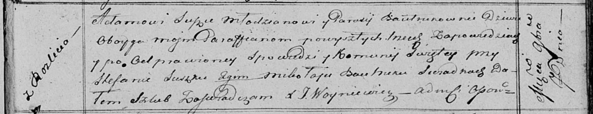

**Сушко Адам (Suszko Adam)**

7 ноября 1815 г -- венчание с девкой Парасей Бавтрук (НИАБ 136-13-920,
лист 22, №7/1815-б (ориг)).

**НИАБ 136-13-894:** Лист 22. **Метрическая запись №7/1815-б (ориг).**

{width="6.496527777777778in"
height="1.2551859142607174in"}

Осовская Покровская церковь. 7 ноября 1815 года. Запись о венчании.

Suszko Adam -- жених, молодой, парафии Осовской, с деревни Разлитье.

Bautrukowna Parasija -- невеста, девка, парафии Осовской.

Suszko Stefan -- свидетель.

Bautruk Mikołay -- свидетель.

Woyniewicz Tomasz -- ксёндз.
