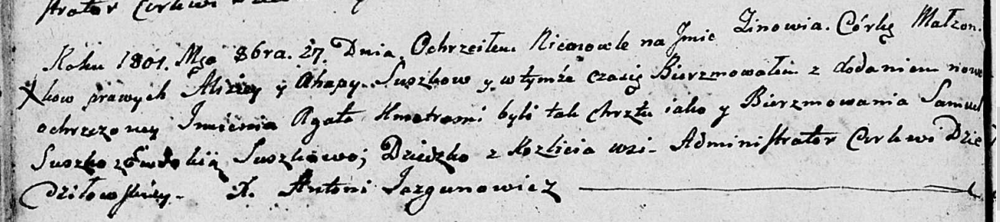
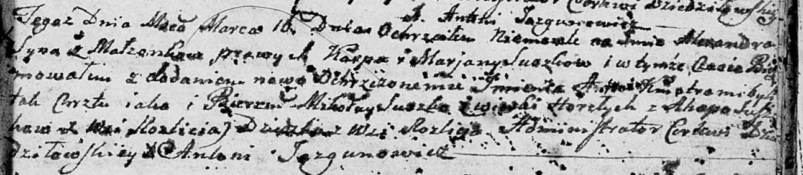
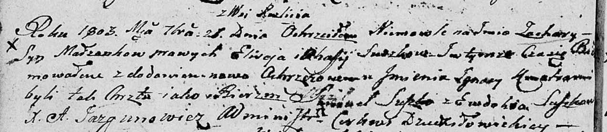
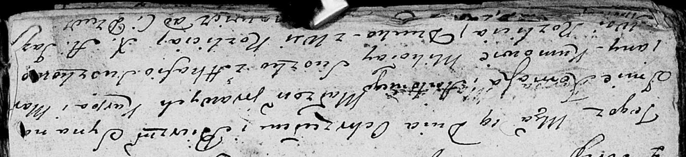
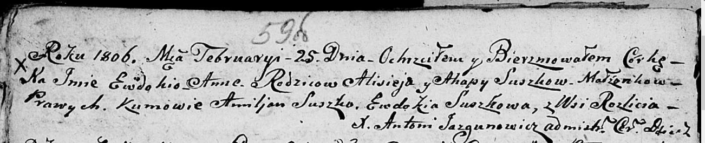
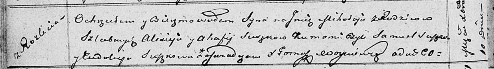

**Сушко Агапа (Suszkowa Ahapa, Ahafija)**

27 октября 1801 г -- крещение дочери Зиновии Агаты (НИАБ 136-13-894,
лист 44об, №25/1801-р (ориг)).

16 марта 1802 г - возможно, крестная мать Александра Антона, сына Сушков
Карпа и Марьяны с деревни Разлитье (НИАБ 136-13-894, лист 46, №11/1802-р
(ориг)).

26 сентября 1803 г -- крещение сына Захарыя Игнацыя (НИАБ 136-13-894,
лист 51об, №37/1803-р (ориг)).

5 декабря 1803 г -- возможно, крестная мать Барбары Цецылии, дочери
Лапецов Якуба и Марьяны с деревни Дедиловичи (НИАБ 136-13-894, лист
52об, №48/1803-р (ориг)).

19 июня 1804 г -- возможно, крестная мать Хомы Антона, сына Сушков Карпа
и Марьяны с деревни Разлитье (НИАБ 136-13-894, лист 53об, №32/1803-р
(ориг)).

25 февраля 1806 г -- крещение дочери Евдокии Анны (НИАБ 136-13-894, лист
59, №7/1806-р (ориг)).

6 августа 1808 г -- крещение сына Доминика (НИАБ 136-13-894, лист 65об,
№24/1808-р (ориг)).

10 декабря 1811 г -- крещение сына Миколая (НИАБ 136-13-894, лист 82об,
№63/1811-р (ориг)).

**НИАБ 136-13-894:** Лист 44об. **Метрическая запись №25/1801-р
(ориг).**

Дедиловичская Покровская церковь. 27 октября 1801 года. Метрическая
запись о крещении.

Suszkowna Zinowia Agata -- дочь родителей с деревни Разлитье.

Suszko Aliziey -- отец.

Suszkowa Ahapa -- мать.

Suszko Samuel -- кум.

Suszkowa Ewdokija -- кума.

Jazgunowicz Antoni -- ксёндз.

**НИАБ 136-13-894:** Лист 46. **Метрическая запись №11/1802-р (ориг).**

Дедиловичская Покровская церковь. 16 марта 1802 года. Метрическая запись
о крещении.

Suszko Alexander Antoni -- сын родителей с деревни Разлитье.

Suszko Karp -- отец.

Suszkowa Marjana -- мать.

Suszko Mikołay -- кум, с деревни Горелое.

Suszkowa Ahapa -- кума, с деревни Разлитье.

Jazgunowicz Antoni -- ксёндз.

**НИАБ 136-13-894:** Лист 51об. **Метрическая запись №37/1803-р
(ориг).**

Дедиловичская Покровская церковь. 26 сентября 1803 года. Метрическая
запись о крещении.

Suszko Zachary Jhnacy -- сын родителей с деревни Разлитье.

Suszko Elisey -- отец.

Suszkowa Ahafija -- мать.

Suszko Samuel -- кум.

Suszkowa Ewdokija -- кума.

Jazgunowicz Antoni -- ксёндз.

**НИАБ 136-13-894:** Лист 52об. **Метрическая запись №48/1803-р
(ориг).**

Дедиловичская Покровская церковь. 5 декабря 1803 года. Метрическая
запись о крещении.

Łapciowna Barbara Cecylia -- дочь родителей с деревни Дедиловичи.

Łapać Jakub -- отец.

Łapciowa Marjana -- мать.

Suszko Leon -- кум, с деревни Разлитье.

Suszkowa Ahafija -- кума, с деревни Разлитье.

Jazgunowicz Antoni -- ксёндз.

**НИАБ 136-13-894:** Лист 53об. **Метрическая запись №17/1804-р
(ориг).**

Дедиловичская Покровская церковь. 19 июня 1804 года. Метрическая запись
о крещении.

\[Suszko\] Tomasz Antoni -- сын родителей с деревни Разлитье.

\[Suszko\] Karp -- отец.

\[Suszkowa\] Marjana -- мать.

Suszko Mikołay -- кум, с деревни Разлитье.

Suszkowa Ahafija -- кума, с деревни Разлитье.

Jazgunowicz Antoni -- ксёндз.

Лист 59об. **Метрическая запись №7/1806-р (ориг).**

Дедиловичская Покровская церковь. 25 февраля 1806 года. Метрическая
запись о крещении.

Suszkowna Ewdokija Anna -- дочь родителей с деревни Разлитье.

Suszko Alisiey -- отец.

Suszkowa Ahapa -- мать.

Suszko Amiljan -- кум.

Suszkowa Ewdokija -- кума.

Jazgunowicz Antoni -- ксёндз.

**НИАБ 136-13-894:** Лист 65об. **Метрическая запись №24/1808-р
(ориг).**

Дедиловичская Покровская церковь. 6 августа 1808 года. Метрическая
запись о крещении.

Suszko Dominik -- сын родителей с деревни Разлитье.

Suszko Alasiey -- отец.

Suszkowa Ahapa -- мать.

Suszko Emiljan -- кум.

Suszkowa Ewdokia -- кума.

Jazgunowicz Antoni -- ксёндз.

**НИАБ 136-13-894:** Лист 82об. **Метрическая запись №63/1811-р
(ориг).**

Осовская Покровская церковь. 10 декабря 1811 года. Метрическая запись о
крещении.

Suszko Mikołay -- сын родителей с деревни Разлитье.

Suszko Alixiey -- отец.

Suszkowa Ahafija -- мать.

Suszko Samuel -- кум.

Suszkowa Eudokija -- кума.

Woyniewicz Tomasz -- ксёндз.
