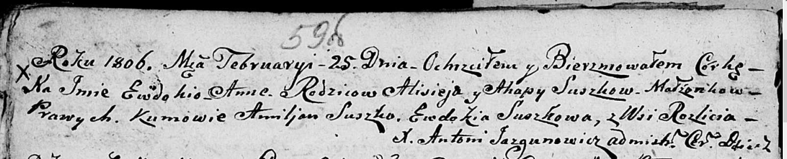

**Сушко Ализей (Suszko Aliziey, Elisey, Alasiey, Alixiey, Alisiey)**

27 октября 1801 г -- крещение дочери Зиновии Агаты (НИАБ 136-13-894,
лист 44об, №25/1801-р (ориг)).

26 сентября 1803 г -- крещение сына Захарыя Игнацыя (НИАБ 136-13-894,
лист 51об, №37/1803-р (ориг)).

25 февраля 1806 г -- крещение дочери Евдокии Анны (НИАБ 136-13-894, лист
59, №7/1806-р (ориг)).

6 августа 1808 г -- крещение сына Доминика (НИАБ 136-13-894, лист 65об,
№24/1808-р (ориг)).

10 декабря 1811 г -- крещение сына Миколая (НИАБ 136-13-894, лист 82об,
№63/1811-р (ориг)).

6 февраля 1813 г -- отпевание, умер в возрасте 40 лет (родился около
1773 г) (НИАБ 136-13-919, лист 25, №5/1813-у (ориг)).

**НИАБ 136-13-894:** Лист 44об. **Метрическая запись №25/1801-р
(ориг).**

{width="6.496527777777778in"
height="1.444268372703412in"}

Дедиловичская Покровская церковь. 27 октября 1801 года. Метрическая
запись о крещении.

Suszkowna Zinowia Agata -- дочь родителей с деревни Разлитье.

Suszko Aliziey -- отец.

Suszkowa Ahapa -- мать.

Suszko Samuel -- кум.

Suszkowa Ewdokija -- кума.

Jazgunowicz Antoni -- ксёндз.

**НИАБ 136-13-894:** Лист 51об. **Метрическая запись №37/1803-р
(ориг).**

{width="6.496527777777778in"
height="1.4201301399825021in"}

Дедиловичская Покровская церковь. 26 сентября 1803 года. Метрическая
запись о крещении.

Suszko Zachary Jhnacy -- сын родителей с деревни Разлитье.

Suszko Elisey -- отец.

Suszkowa Ahafija -- мать.

Suszko Samuel -- кум.

Suszkowa Ewdokija -- кума.

Jazgunowicz Antoni -- ксёндз.

**НИАБ 136-13-894:** Лист 59об. **Метрическая запись №7/1806-р (ориг).**

{width="6.496527777777778in"
height="1.3222364391951007in"}

Дедиловичская Покровская церковь. 25 февраля 1806 года. Метрическая
запись о крещении.

Suszkowna Ewdokija Anna -- дочь родителей с деревни Разлитье.

Suszko Alisiey -- отец.

Suszkowa Ahapa -- мать.

Suszko Amiljan -- кум.

Suszkowa Ewdokija -- кума.

Jazgunowicz Antoni -- ксёндз.

**НИАБ 136-13-894:** Лист 65об. **Метрическая запись №24/1808-р
(ориг).**

{width="6.496527777777778in"
height="1.1753958880139983in"}

Дедиловичская Покровская церковь. 6 августа 1808 года. Метрическая
запись о крещении.

Suszko Dominik -- сын родителей с деревни Разлитье.

Suszko Alasiey -- отец.

Suszkowa Ahapa -- мать.

Suszko Emiljan -- кум.

Suszkowa Ewdokia -- кума.

Jazgunowicz Antoni -- ксёндз.

**НИАБ 136-13-894:** Лист 82об. **Метрическая запись №63/1811-р
(ориг).**

{width="6.496527777777778in"
height="0.9212740594925635in"}

Осовская Покровская церковь. 10 декабря 1811 года. Метрическая запись о
крещении.

Suszko Mikołay -- сын родителей с деревни Разлитье.

Suszko Alixiey -- отец.

Suszkowa Ahafija -- мать.

Suszko Samuel -- кум.

Suszkowa Eudokija -- кума.

Woyniewicz Tomasz -- ксёндз.

**НИАБ 136-13-919:** Лист 25. **Метрическая запись №5/1813-у (ориг).**

{width="6.496527777777778in"
height="1.1034722222222222in"}

Осовская униатская церковь. 6 февраля 1813 года. Метрическая запись об
отпевании.

Suszko Alisiey -- умерший, 40 лет, с деревни Разлитье, похоронен на
кладбище деревни Разлитье.

Woyniewicz Tomasz -- ксёндз.
