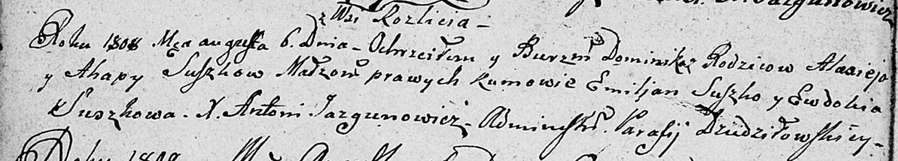

**Сушко Доминик Ализеев (Suszko Dominik)**

6 августа 1808 г -- крещение (НИАБ 136-13-894, лист 65об, №24/1808-р
(ориг)).

**НИАБ 136-13-894:** Лист 65об. **Метрическая запись №24/1808-р
(ориг).**

Дедиловичская Покровская церковь. 6 августа 1808 года. Метрическая
запись о крещении.

Suszko Dominik -- сын родителей с деревни Разлитье.

Suszko Alasiey -- отец.

Suszkowa Ahapa -- мать.

Suszko Emiljan -- кум.

Suszkowa Ewdokia -- кума.

Jazgunowicz Antoni -- ксёндз.
