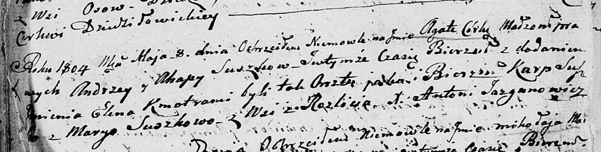

**Сушко Андрей (Suszko Andrzey)**

1 апреля 1798 г -- крещение дочери Евы (НИАБ 136-13-894, лист 35об,
№12/1798-р (ориг)), (РГИА 823-2-18, лист 262об, №12/1798-р (коп)).

8 мая 1804 г -- крещение дочери Агаты Елены (НИАБ 136-13-894, лист 53об,
№12/1804-р (ориг)).

28 октября 1812 г -- крещение дочери Зеновии (НИАБ 136-13-894, лист 85,
№48/1812-р (ориг)).

**НИАБ 136-13-894:** Лист 35-об. **Метрическая запись №12.**

{width="6.496527777777778in"
height="0.6524015748031496in"}

Дедиловичская Покровская церковь. 1 апреля 1798 года. Метрическая запись
о крещении.

Suszkowna Ewa -- дочь родителей с деревни Разлитье.

Suszko Andrzey -- отец.

Suszkowa Ahafija -- мать.

Suszko Karp - кум.

Suszkowa Maryia - кума.

Jazgunowicz Antoni -- ксёндз.

**РГИА 823-2-18:** Лист 262об. **Метрическая запись №12/1798-р (коп).**

{width="6.496527777777778in"
height="1.6854166666666666in"}

Дедиловичская Покровская церковь. 1 апреля 1798 года. Метрическая запись
о крещении.

Szuszkowna Ewa -- дочь родителей с деревни Разлитье.

Szuszko Andrzey -- отец.

Szuszkowa Ahafija -- мать.

Szuszko Karp -- кум.

Szuszkowa Maria -- кума.

Jazgunowicz Antoni -- ксёндз.

**НИАБ 136-13-894:** Лист 53об. **Метрическая запись №12/1804-р
(ориг).**

{width="6.496527777777778in"
height="1.650784120734908in"}

Дедиловичская Покровская церковь. 8 мая 1804 года. Метрическая запись о
крещении.

Suszkowna Agata Elena -- дочь родителей с деревни Разлитье.

Suszko Andrzey -- отец.

Suszkowa Ahapa -- мать.

Suszko Karp -- кум.

Suszkowa Maryia -- кума.

Jazgunowicz Antoni -- ксёндз.

**НИАБ 136-13-894:** Лист 85. **Метрическая запись №48/1812-р (ориг).**

{width="6.496527777777778in"
height="0.6765398075240595in"}

Осовская Покровская церковь. 28 октября 1812 года. Метрическая запись о
крещении.

Suszkowa Zienowia -- дочь родителей с деревни Разлитье.

Suszko Andrzey -- отец.

Suszkowa Agata -- мать.

Suszko Karp -- кум.

Suszkowa Marja -- кума.

Woyniewicz Tomasz -- ксёндз.
