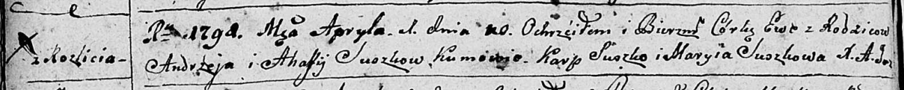
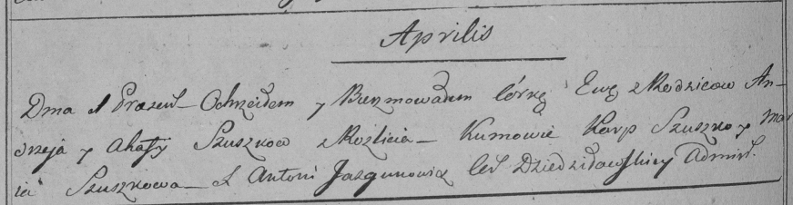

**Сушко Ева Андреева (Suszkowna Ewa)**

1 апреля 1798 г -- крещение (НИАБ 136-13-894, лист 35об, №12/1798-р
(ориг)), (РГИА 823-2-18, лист 262об, №12/1798-р (коп)).

**НИАБ 136-13-894:** Лист 35-об. **Метрическая запись №12.**

Дедиловичская Покровская церковь. 1 апреля 1798 года. Метрическая запись
о крещении.

Suszkowna Ewa -- дочь родителей с деревни Разлитье.

Suszko Andrzey -- отец.

Suszkowa Ahafija -- мать.

Suszko Karp - кум.

Suszkowa Maryia - кума.

Jazgunowicz Antoni -- ксёндз.

**РГИА 823-2-18:** Лист 262об. **Метрическая запись №12/1798-р (коп).**

Дедиловичская Покровская церковь. 1 апреля 1798 года. Метрическая запись
о крещении.

Szuszkowna Ewa -- дочь родителей с деревни Разлитье.

Szuszko Andrzey -- отец.

Szuszkowa Ahafija -- мать.

Szuszko Karp -- кум.

Szuszkowa Maria -- кума.

Jazgunowicz Antoni -- ксёндз.
