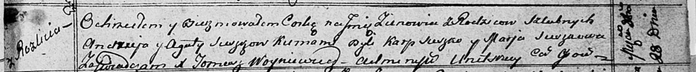

**Сушко Зеновия Андреева (Suszkowna Zienowia)**

28 октября 1812 г -- крещение (НИАБ 136-13-894, лист 85, №48/1812-р
(ориг)).

**НИАБ 136-13-894:** Лист 85. **Метрическая запись №48/1812-р (ориг).**

Осовская Покровская церковь. 28 октября 1812 года. Метрическая запись о
крещении.

Suszkowa Zienowia -- дочь родителей с деревни Разлитье.

Suszko Andrzey -- отец.

Suszkowa Agata -- мать.

Suszko Karp -- кум.

Suszkowa Marja -- кума.

Woyniewicz Tomasz -- ксёндз.
