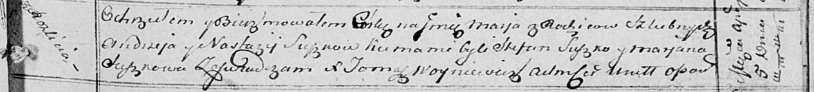

**Сушко Марья Андреева (Suszkowna Marja)**

5 апреля 1814 г -- крещение (НИАБ 136-13-894, лист 89, №24/1814-р
(ориг)).

**НИАБ 136-13-894:** Лист 89. **Метрическая запись №24/1814-р (ориг).**

{width="6.496527777777778in"
height="0.7342038495188101in"}

Осовская Покровская церковь. 5 апреля 1814 года. Метрическая запись о
крещении.

Suszkowna Marja -- дочь родителей с деревни Разлитье.

Suszko Andrzey -- отец.

Suszkowa Nastazija -- мать.

Suszko Stefan -- кум.

Suszkowa Marjana -- кума.

Woyniewicz Tomasz -- ксёндз.
