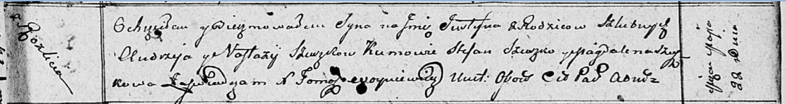

**Сушко Юстын Андреев (Suszko Justyn)**

22 мая 1811 г -- крещение (НИАБ 136-13-894, лист 81, №26/1811-р (ориг)).

**НИАБ 136-13-894:** Лист 81. **Метрическая запись №26/1811-р (ориг).**

Осовская Покровская церковь. 22 мая 1811 года. Метрическая запись о
крещении.

Szuszko Justyn -- сын родителей с деревни Разлитье.

Szuszko Andrzey -- отец.

Szuszkowa Nastazya -- мать.

Szuszko Stefan -- кум.

Szuszkowa Magdalena -- кума.

Woyniewicz Tomasz -- ксёндз.
