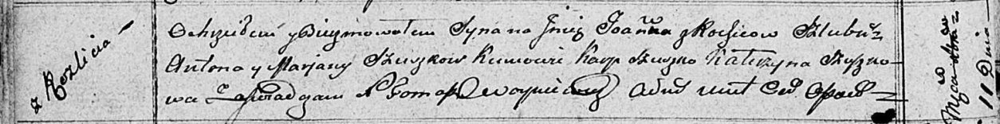

**Сушко Иоанн Антонов (Szuszko Joann)**

11 декабря 1810 г -- крещение (НИАБ 136-13-894, лист 79об, №63/1810-р
(ориг)).

**НИАБ 136-13-894:** Лист 79об. **Метрическая запись №63/1810-р
(ориг).**

{width="6.496527777777778in"
height="0.8079593175853018in"}

Осовская Покровская церковь. 11 декабря 1810 года. Метрическая запись о
крещении.

Szuszko Joann -- сын родителей с деревни Разлитье.

Szuszko Anton -- отец.

Szuszkowa Marjana -- мать.

Szuszko Karp -- кум.

Szuszkowa Katerzyna -- кума.

Woyniewicz Tomasz -- ксёндз.
