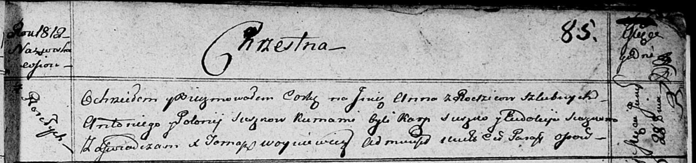

**Сушко Анна Антонова (Suszkowna Anna)**

28 июля 1812 г -- крещение (НИАБ 136-13-894, лист 85, №37/1817-р
(ориг)).

**НИАБ 136-13-894:** Лист 85. **Метрическая запись №37/1812-р (ориг).**

{width="6.496527777777778in"
height="1.5260706474190726in"}

Осовская Покровская церковь. 28 июля 1812 года. Метрическая запись о
крещении.

Suszkowna Anna -- дочь родителей с деревни Разлитье.

Suszko Antoni -- отец.

Suszkowa Połonija -- мать.

Suszko Karp -- кум.

Suszkowa Eudokija -- кума.

Woyniewicz Tomasz -- ксёндз.
