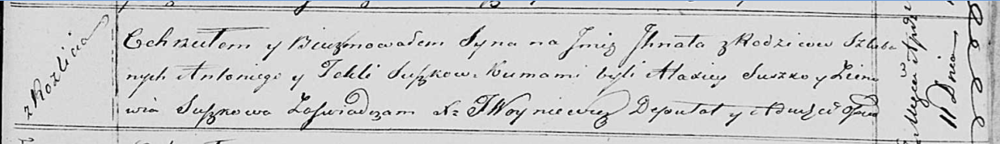

**Сушко Игнат Антониев (Suszko Jhnat)**

1 апреля 1820 г -- крещение (НИАБ 136-13-894, лист 104, №11/1820-р
(ориг)).

**НИАБ 136-13-894:** Лист 104. **Метрическая запись №11/1820-р (ориг).**

Осовская Покровская церковь. 1 апреля 1820 года. Метрическая запись о
крещении.

Suszko Jhnat -- сын родителей с деревни Разлитье.

Suszko Antoni -- отец.

Suszkowa Tekla -- мать.

Suszko Alaxiey -- кум.

Suszkowa Zienowia -- кума.

Woyniewicz Tomasz -- ксёндз.
