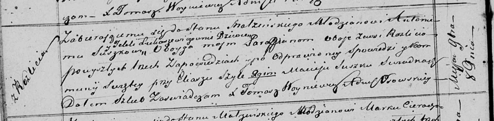
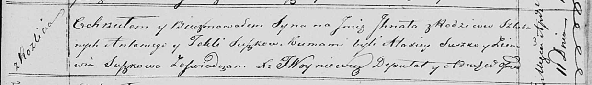

**Сушко (в девичестве Лукашевич) Текля (Suszkowa Tekla z
Łukaszewiczow)**

8 ноября 1819 г -- венчание с молодым Антонием Сушко с деревни Разлитье
(НИАБ 136-13-920, лист 26об, №9/1819-б (ориг)).

1 апреля 1820 г -- крещение сына Игната (НИАБ 136-13-894, лист 104,
№11/1820-р (ориг)).

**НИАБ 136-13-920:** Лист 26об. **Метрическая запись №9/1819-б (ориг).**

Осовская Покровская церковь. 8 ноября 1819 года. Запись о венчании.

Suszko Antoni -- жених, молодой, парафии Осовской, с деревни Разлитье.

Łukaszewiczowna Tekla -- невеста, девка, парафии Осовской, с деревни
Разлитье.

Szyło Eliasz -- свидетель.

Suszko Maciey -- свидетель.

Woyniewicz Tomasz -- ксёндз.

**НИАБ 136-13-894:** Лист 104. **Метрическая запись №11/1820-р (ориг).**

Осовская Покровская церковь. 1 апреля 1820 года. Метрическая запись о
крещении.

Suszko Jhnat -- сын родителей с деревни Разлитье.

Suszko Antoni -- отец.

Suszkowa Tekla -- мать.

Suszko Alaxiey -- кум.

Suszkowa Zienowia -- кума.

Woyniewicz Tomasz -- ксёндз.
