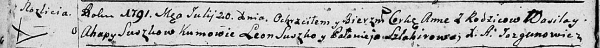

**Сушко Анна Василева (Suszkowa Anna)**

20 июля 1791 г -- крещение (НИАБ 136-13-894, лист 13об, №32/1791-р
(ориг)).

**НИАБ 136-13-894:** Лист 13об. **Метрическая запись №32/1791-р
(ориг).**

Дедиловичская Покровская церковь. 20 июля 1791 года. Метрическая запись
о крещении.

Suszkowna Anna -- дочь родителей с деревни Разлитье.

Suszko Wasil -- отец.

Suszkowa Ahapa -- мать.

Suszko Leon - кум.

Szłakirowa Polonieja - кума.

Jazgunowicz Antoni -- ксёндз.
