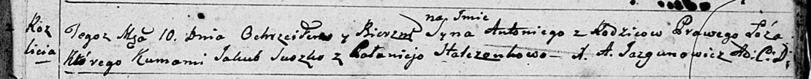
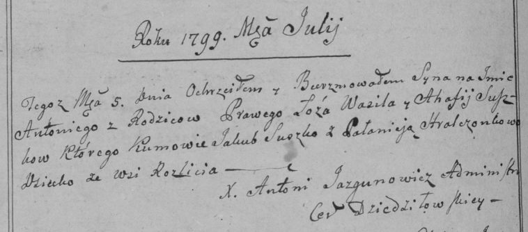

**Сушко Антон Василев (Suszko Antoni)**

10 июля 1799 г -- крещение (НИАБ 136-13-894, лист 39, №27/1799-р
(ориг)), (РГИА 823-2-18, лист 270об, №26/1799-р (коп)).

**НИАБ 136-13-894:** Лист 39. **Метрическая запись №27/1799-р (ориг).**

Дедиловичская Покровская церковь. 10 июля 1799 года. Метрическая запись
о крещении.

\[Suszko\] Antoni -- сын родителей с деревни Разлитье.

\[Suszko Wasil -- отец.\]

\[Suszkowa Ahafija -- мать.\]

Suszko Jakub -- кум.

Stralczonkowa Palanieja -- кума.

Jazgunowicz Antoni -- ксёндз.

**РГИА 823-2-18:** Лист 270об. **Метрическая запись №26/1799-р (коп).**

Дедиловичская Покровская церковь. 5 июля 1799 года. Метрическая запись о
крещении.

Suszko Antoni -- сын родителей с деревни Разлитье.

Suszko Wasil -- отец.

Suszkowa Ahafija -- мать.

Suszko Jakub -- кум.

Stralczonkowa Pałanieja -- кума.

Jazgunowicz Antoni -- ксёндз.
