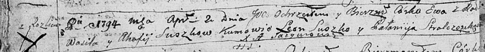

**Сушко Ева Василева (Suszkowna Ewa)**

2 апреля 1794 г -- крещение (НИАБ 136-13-894, лист 21об, №18/1794-р
(ориг)).

**НИАБ 136-13-894:** Лист 21-об. **Метрическая запись №18/1794-р
(ориг).**

Дедиловичская Покровская церковь. 2 апреля 1794 года. Метрическая запись
о крещении.

Suszkowna Ewa -- дочь родителей с деревни Разлитье.

Suszko Wasil -- отец.

Suszkowa Ahafija -- мать.

Suszko Leon - кум.

Stralczonkowa Pałanieja - кума.

Jazgunowicz Antoni -- ксёндз.
