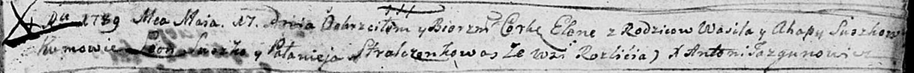

**Сушко Елена Василева (Suszkowna Elena)**

17 мая 1789 г -- крещение (НИАБ 136-13-894, лист 7, №27/1789-р (ориг)).

**НИАБ 136-13-894:** Лист 7. **Метрическая запись №27/1789-р (ориг).**

Дедиловичская Покровская церковь. 17 мая 1789 года. Метрическая запись о
крещении.

Suszkowna Elena -- дочь родителей с деревни Разлитье.

Suszko Wasil -- отец.

Suszkowa Ahapa -- мать.

Suszko Leon - кум.

Stralczonkowa Palanieja - кума.

Jazgunowicz Antoni -- ксёндз.
