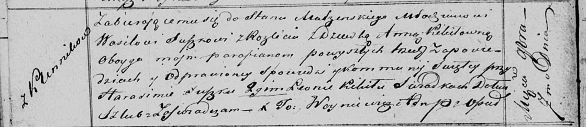

**Сушко (в девичестве Кикило) Анна (Suszkowa Anna z Kikiłow)**

7 ноября 1820 г -- венчание с молодым Василём Сушко с деревни Разлитье
(НИАБ 136-13-920, лист 27об, №9/1820-б (ориг)).

**НИАБ 136-13-894:** Лист 27об. **Метрическая запись №9/1820-б (ориг).**

Осовская Покровская церковь. 7 ноября 1820 года. Запись о венчании.

Suszko Wasil -- жених, молодой, парафии Осовской, с деревни Разлитье.

Kikiłowna Anna -- невеста, девка, парафии Осовской, с деревни Клинники.

Suszko Harasim -- свидетель.

Kikiło Leon -- свидетель.

Woyniewicz Tomasz -- ксёндз.
