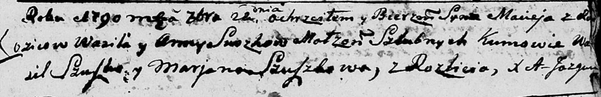
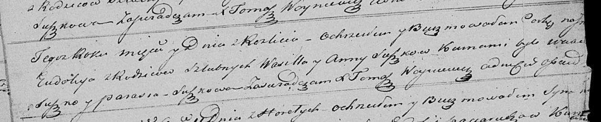

**Сушко Анна (Suszkowa Anna)**

22 сентября 1790 г -- крещение сына Мацея (НИАБ 136-13-894, лист 11,
№65/1790-р (ориг)).

13 ноября 1821 г -- крещение дочери Евдокии (НИАБ 136-13-894, лист
107об, №52/1821-р (ориг)).

**НИАБ 136-13-894:** Лист 11. **Метрическая запись №65/1790-р (ориг).**

Дедиловичская Покровская церковь. 22 сентября 1790 года. Метрическая
запись о крещении.

Suszko Maciej -- сын родителей с деревни Разлитье.

Suszko Wasil -- отец.

Suszkowa Anna -- мать.

Szuszko Wasil - кум.

Szuszkowa Marjana - кума.

Jazgunowicz Antoni -- ксёндз.

**НИАБ 136-13-894:** Лист 107об. **Метрическая запись №52/1821-р
(ориг).**

Осовская Покровская церковь. 13 ноября 1821 года. Метрическая запись о
крещении.

Suszkowna Eudokija -- дочь родителей с деревни Разлитье.

Suszko Wasil -- отец.

Suszkowa Anna -- мать.

Suszko Wasil? -- кум.

Suszkowa Parasia -- кума.

Woyniewicz Tomasz -- ксёндз.
