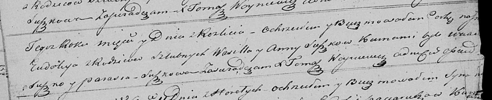

**Сушко Евдокия Василева (Suszkowna Eudokija)**

13 ноября 1821 г -- крещение (НИАБ 136-13-894, лист 107об, №52/1821-р
(ориг)).

**НИАБ 136-13-894:** Лист 107об. **Метрическая запись №52/1821-р
(ориг).**

Осовская Покровская церковь. 13 ноября 1821 года. Метрическая запись о
крещении.

Suszkowna Eudokija -- дочь родителей с деревни Разлитье.

Suszko Wasil -- отец.

Suszkowa Anna -- мать.

Suszko Wasil? -- кум.

Suszkowa Parasia -- кума.

Woyniewicz Tomasz -- ксёндз.
