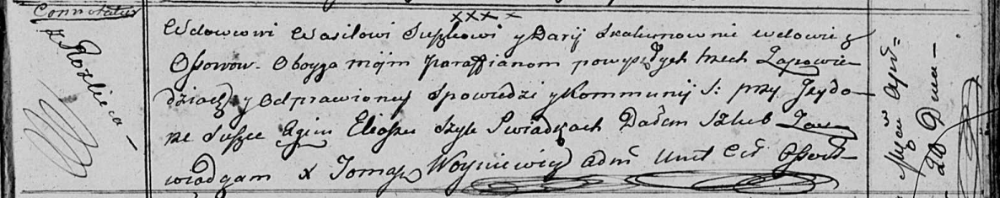
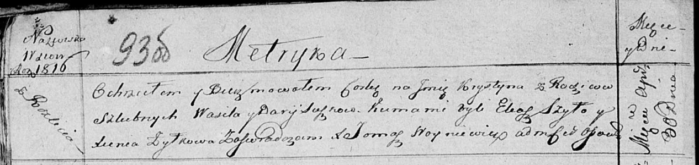
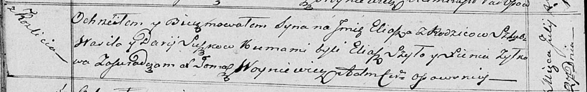

**Сушко Василь (Suszko Wasil)**

28 апреля 1813 г -- венчание с вдовой Дарьей Скакун с деревни Осово
(НИАБ 136-13-920, лист 19, №4/1813-б (ориг)).

30 апреля 1816 г -- крещение дочери Крыстыны (НИАБ 136-13-894, лист
93об, №7/1816-р (ориг)).

27 июля 1818 г -- крещение сына Ильи (НИАБ 136-13-894, лист 98об,
№23/1818-р (ориг)).

5 декабря 1820 г -- крещение дочери Катерыны (НИАБ 136-13-894, лист 105,
№44/1820-р (ориг)).

**НИАБ 136-13-920:** Лист 19. **Метрическая запись №4/1813-б (ориг).**

Осовская Покровская церковь. 28 апреля 1813 года. Запись о венчании.

Suszko Wasil -- жених, вдовец, парафии Осовской, с деревни Разлитье.

Skakunowna Darija -- невеста, вдова, парафии Осовской, с деревни Осово.

Suszko Jzydor -- свидетель.

Szyło Eliasz -- свидетель.

Woyniewicz Tomasz -- ксёндз.

**НИАБ 136-13-894:** Лист 93об. **Метрическая запись №7/1816-р (ориг).**

Осовская Покровская церковь. 30 апреля 1816 года. Метрическая запись о
крещении.

Suszkowna Krystyna -- дочь родителей с деревни Разлитье.

Suszko Wasil -- отец.

Suszkowa Darja -- мать.

Szyło Eliasz -- кум.

Żyłkowa Xienia -- кума.

Woyniewicz Tomasz -- ксёндз.

**НИАБ 136-13-894:** Лист 98об. **Метрическая запись №23/1818-р
(ориг).**

Осовская Покровская церковь. 27 июля 1818 года. Метрическая запись о
крещении.

Suszko Eliasz -- сын родителей с деревни Разлитье.

Suszko Wasil -- отец.

Suszkowa Darija -- мать.

Szyło Eliasz -- кум.

Żyłko Xienia -- кума.

Woyniewicz Tomasz -- ксёндз.

**НИАБ 136-13-894:** Лист 105. **Метрическая запись №44/1820-р (ориг).**

Осовская Покровская церковь. 5 декабря 1820 года. Метрическая запись о
крещении.

Suszkowna Katerzyna -- дочь родителей с деревни Разлитье.

Suszko Wasil -- отец.

Suszzkowa Darija -- мать.

Szyło Eliasz -- кум.

Zyskowa Xienia -- кума.

Woyniewicz Tomasz -- ксёндз.
