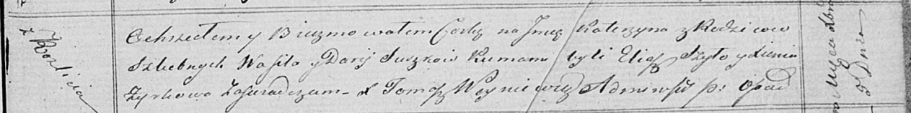

**Сушко Катерына Василева (Suszkowna Katerzyna)**

5 декабря 1820 г -- крещение (НИАБ 136-13-894, лист 105, №44/1820-р
(ориг)).

**НИАБ 136-13-894:** Лист 105. **Метрическая запись №44/1820-р (ориг).**

Осовская Покровская церковь. 5 декабря 1820 года. Метрическая запись о
крещении.

Suszkowna Katerzyna -- дочь родителей с деревни Разлитье.

Suszko Wasil -- отец.

Suszzkowa Darija -- мать.

Szyło Eliasz -- кум.

Zyskowa Xienia -- кума.

Woyniewicz Tomasz -- ксёндз.
