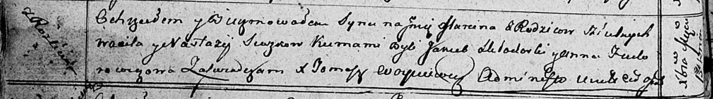

**Сушко Василь (Szuszko Wasil)**

8 ноября 1808 г -- венчание с Настой Сушко (НИАБ 136-13-920, лист 14,
№10/1808-б (ориг)).

1 ноября 1810 г -- крещение дочери Марцелы (НИАБ 136-13-894, лист 79об,
№55/1810-р (ориг)).

13 декабря 1812 г -- крещение сына Марцина (НИАБ 136-13-894, лист 85об,
№59/1812-р (ориг)).

**НИАБ 136-13-920:** Лист 14. **Метрическая запись №10/1808-б (ориг).**

{width="6.496527777777778in"
height="0.8421544181977253in"}

Дедиловичская Покровская церковь. 8 ноября 1808 года. Метрическая запись
о венчании.

Suszko Wasil -- жених, с деревни \[Разлитье\].

Suszkowna Nasta -- невеста.

Suszko Jzydor -- свидетель.

Suszko Markian -- свидетель, с деревни Дедиловичи.

Jazgunowicz Antoni -- ксёндз.

**НИАБ 136-13-894:** Лист 79об. **Метрическая запись №55/1810-р
(ориг).**

{width="6.496527777777778in"
height="0.8837259405074366in"}

Осовская Покровская церковь. 1 ноября 1810 года. Метрическая запись о
крещении.

Szuszkowna Marcella -- дочь родителей с деревни Разлитье.

Szuszko Wasil -- отец.

Szuszkowa Nastazya -- мать.

Szuszko Taras -- кум.

Łapciowa Anna -- кума.

Woyniewicz Tomasz -- ксёндз.

**НИАБ 136-13-894:** Лист 85об. **Метрическая запись №59/1812-р
(ориг).**

{width="6.496527777777778in"
height="0.9065234033245845in"}

Осовская Покровская церковь. 13 декабря 1812 года. Метрическая запись о
крещении.

Suszko Marcin -- сын родителей с деревни Разлитье.

Suszko Wasil -- отец.

Suszkowa Nastazija -- мать.

\...oski Jakub -- кум.

Fiedorowiczowa Anna -- кума.

Woyniewicz Tomasz -- ксёндз.
