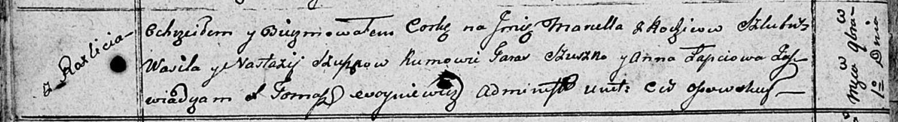

**Сушко Марцела Василева (Szuszko Marcella)**

1 ноября 1810 г -- крещение (НИАБ 136-13-894, лист 79об, №55/1810-р
(ориг)).

**НИАБ 136-13-894:** Лист 79об. **Метрическая запись №55/1810-р
(ориг).**

Осовская Покровская церковь. 1 ноября 1810 года. Метрическая запись о
крещении.

Szuszkowna Marcella -- дочь родителей с деревни Разлитье.

Szuszko Wasil -- отец.

Szuszkowa Nastazya -- мать.

Szuszko Taras -- кум.

Łapciowa Anna -- кума.

Woyniewicz Tomasz -- ксёндз.
