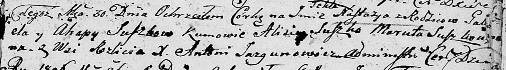

**Сушко Габриэль (Suszko Gabriel)**

30 сентября 1806 г -- крещение дочери Настасьи Текли (НИАБ 136-13-894,
лист 60, №43/1806-р (ориг)).

**НИАБ 136-13-894:** Лист 61. **Метрическая запись №43/1806-р (ориг).**

{width="6.496527777777778in"
height="0.915239501312336in"}

Дедиловичская Покровская церковь. 30 сентября 1806 года. Метрическая
запись о крещении.

Suszkowna Nastazya Tekla -- дочь родителей с деревни Разлитье.

Suszko Gabriel -- отец.

Suszkowa Ahapa -- мать.

Suszko Alisiey -- кум.

Suszkowna Maruta -- кума.

Jazgunowicz Antoni -- ксёндз.
