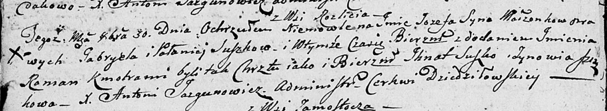

**Сушко Габриэль (Suszko Gabriel)**

6 декабря 1802 г -- крещение дочери Анны Клары (НИАБ 136-13-894, лист
48об, №43/1802-р (ориг)).

30 октября 1804 г -- крещение сына Иосифа Романа (НИАБ 136-13-894, лист
55об, №51/1804-р (ориг)).

**НИАБ 136-13-894:** Лист 48об. **Метрическая запись №43/1802-р
(ориг).**

{width="6.496527777777778in"
height="1.5079669728783902in"}

Дедиловичская Покровская церковь. 6 декабря 1802 года. Метрическая
запись о крещении.

Suszkowna Anna Klara -- дочь родителей с деревни Разлитье.

Suszko Gabriel -- отец.

Suszkowa Pałanieja -- мать.

Suszko Jgnacy -- кум.

Suszkowa Zynowia -- кума.

Jazgunowicz Antoni -- ксёндз.

**НИАБ 136-13-894:** Лист 55об. **Метрическая запись №51/1804-р
(ориг).**

{width="6.496527777777778in"
height="1.2015463692038495in"}

Дедиловичская Покровская церковь. 30 октября 1804 года. Метрическая
запись о крещении.

Suszko Jozef Roman -- сын родителей с деревни Разлитье.

Suszko Gabriel -- отец.

Suszkowa Pałanieja -- мать.

Suszko Jhnat -- кум.

Suszkowa Zynowia -- кума.

Jazgunowicz Antoni -- ксёндз.
