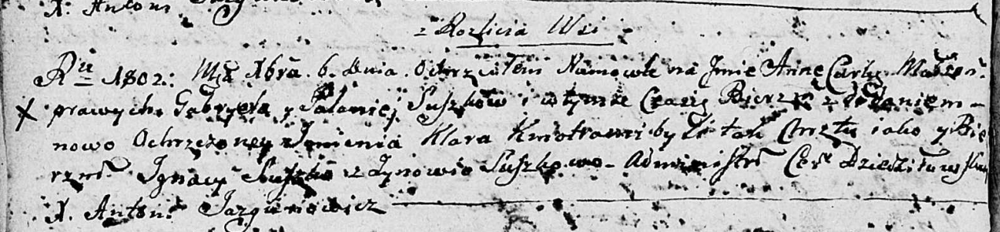

**Сушко Иосиф Габриэлев (Suszko Jozef Roman)**

30 октября 1804 г -- крещение (НИАБ 136-13-894, лист 55об, №51/1804-р
(ориг)).

**НИАБ 136-13-894:** Лист 55об. **Метрическая запись №51/1804-р
(ориг).**

{width="6.496527777777778in"
height="1.2015463692038495in"}

Дедиловичская Покровская церковь. 30 октября 1804 года. Метрическая
запись о крещении.

Suszko Jozef Roman -- сын родителей с деревни Разлитье.

Suszko Gabriel -- отец.

Suszkowa Pałanieja -- мать.

Suszko Jhnat -- кум.

Suszkowa Zynowia -- кума.

Jazgunowicz Antoni -- ксёндз.
