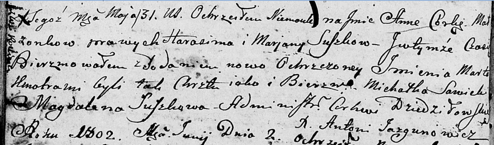

**Сушко Анна Гарасимова (Suszkowna Anna Marta)**

31 мая 1802 г -- крещение (НИАБ 136-13-894, лист 46об, №18/1802-р
(ориг)).

**НИАБ 136-13-894:** Лист 40об. **Метрическая запись №5/1800-р (ориг).**

Дедиловичская Покровская церковь. 12 января 1800 года. Метрическая
запись о крещении.

Suszko Jozef Jan -- сын родителей с деревни Разлитье.

Suszko Harasim -- отец.

Suszkowa Marjana -- мать.

Sawicki Michał -- кум, с деревни Дедиловичи.

Suszkowa Magdalena -- кума, с деревни Разлитье.

Jazgunowicz Antoni -- ксёндз.

Лист 46об. **Метрическая запись №18/1802-р (ориг).**

Дедиловичская Покровская церковь. 31 мая 1802 года. Метрическая запись о
крещении.

Suszkowna Anna Marta -- дочь родителей с деревни Разлитье.

Suszko Harasim -- отец.

Suszkowa Marjana -- мать.

Sawicki Michałka -- кум.

Suszkowa Magdalena -- кума.

Jazgunowicz Antoni -- ксёндз.
