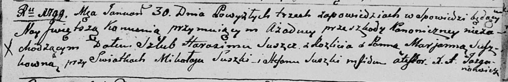
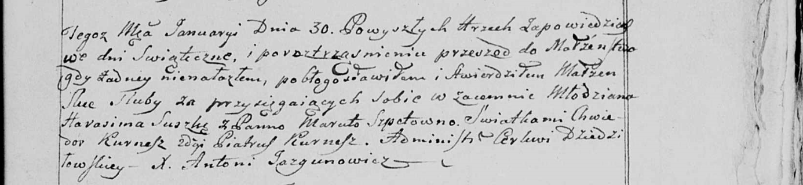
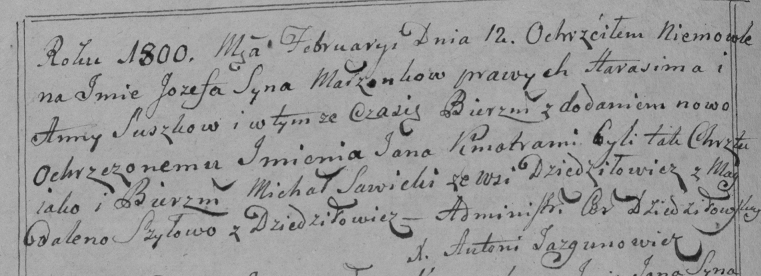
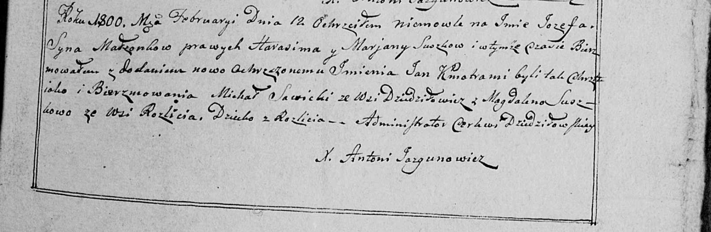
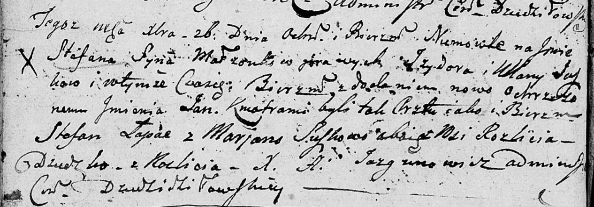

**Сушко (Сушко) Марьяна (Suszkowa (Suszkowna) Marjana)**

30 января 1799 г -- венчание с Гарасимом Сушко с деревни Разлитье (НИАБ
136-13-920, лист 6, №1/1799-б (ориг), НИАБ 136-13-938, лист 246,
№1/1799-б (коп)).

12 января 1800 г -- крещение сына Иосифа Яна (НИАБ 136-13-894, лист
40об, №5/1800-р (ориг)), (РГИА 823-2-18, лист 274об, №5/1800-р (коп),
НИАБ 136-13-949, лист 101, №5/1800-р (коп)).

31 мая 1802 г -- крещение дочери Анны Марты (НИАБ 136-13-894, лист 46об,
№18/1802-р (ориг)).

26 декабря 1803 -- возможно, крестная мать Степана Яна, сына Сушков
Изыдора и Ульяны с деревни Разлитье (НИАБ 136-13-894, лист 52об,
№49/1803-р (ориг)).

30 мая 1808 г -- крещение сына Яна Марцина (НИАБ 136-13-894, лист 65,
№21/1808-р (ориг)).

**НИАБ 136-13-920:** Лист 6. **Метрическая запись №1/1799-б (ориг).**

Дедиловичская Покровская церковь. 30 января 1799 года. Метрическая
запись о венчании.

Suszko Harasim -- жених, деревня Разлитье.

Suszkowna Marjanna -- невеста.

Suszko Mikałay -- свидетель.

Suszko Stefan -- свидетель.

Jazgunowicz Antoni -- ксёндз.

**НИАБ 136-13-938:** Лист 246. **Метрическая запись №1/1799-б (коп).**

(См. тж. НИАБ 136-13-920, лист 6, №1/1799-б (ориг))

Дедиловичская Покровская церковь. 30 января 1799 года. Метрическая
запись о венчании.

Suszko Harasim -- жених, молодой, с деревни \[Разлитье\].

Spetowna Maruta \[Suszkowna Marjanna\] -- невеста.

Kurnesz Chwiedor \[Suszko Mikałay\] -- свидетель.

Kurnesz Piatruś \[Suszko Stefan\] -- свидетель.

Jazgunowicz Antoni -- ксёндз.

**НИАБ 136-13-894:** Лист 40об. **Метрическая запись №5/1800-р (ориг).**

Дедиловичская Покровская церковь. 12 января 1800 года. Метрическая
запись о крещении.

Suszko Jozef Jan -- сын родителей с деревни Разлитье.

Suszko Harasim -- отец.

Suszkowa Marjana -- мать.

Sawicki Michał -- кум, с деревни Дедиловичи.

Suszkowa Magdalena -- кума, с деревни Разлитье.

Jazgunowicz Antoni -- ксёндз.

**РГИА 823-2-18:** Лист 274об. **Метрическая запись №5/1800-р (коп).**

Дедиловичская Покровская церковь. 12 февраля 1800 года. Метрическая
запись о крещении.

Suszko Jozef Jan -- сын \[родителей с деревни Разлитье\].

Suszko Harasim -- отец.

Suszkowa Anna -- мать.

Sawicki Michał -- кум, с деревни Дедиловичи.

Szyłowa \[Suszkowa\] Magdalena -- кума, с деревни Дедиловичи.

Jazgunowicz Antoni -- ксёндз.

**НИАБ 136-13-949:** Лист 101. **Метрическая запись №5/1800-р (коп).**

(См. тж.: РГИА 823-2-18, лист 274об, №5/1800-р (коп), НИАБ 136-13-894,
лист 40об, №5/1800-р (ориг))

Дедиловичская Покровская церковь. 12 февраля 1800 года. Метрическая
запись о крещении.

Suszko Jozef Jan -- сын родителей с деревни Разлитье.

Suszko Harasim -- отец.

Suszkowa Marjana -- мать.

Savicki Michał -- кум, с деревни Дедиловичи.

Suszkowa Magdalena - кума, с деревни Разлитье.

Jazgunowicz Antoni -- ксёндз.

**НИАБ 136-13-894:** Лист 46об. **Метрическая запись №18/1802-р
(ориг).**

Дедиловичская Покровская церковь. 31 мая 1802 года. Метрическая запись о
крещении.

Suszkowna Anna Marta -- дочь родителей с деревни Разлитье.

Suszko Harasim -- отец.

Suszkowa Marjana -- мать.

Sawicki Michałka -- кум.

Suszkowa Magdalena -- кума.

Jazgunowicz Antoni -- ксёндз.

**НИАБ 136-13-894:** Лист 52об. **Метрическая запись №49/1803-р
(ориг).**

Дедиловичская Покровская церковь. 26 декабря 1803 года. Метрическая
запись о крещении.

Suszko Stefan Jan -- сын родителей с деревни Разлитье.

Suszko Jzydor -- отец.

Suszkowa Ullana -- мать.

Łapać Stefan -- кум, с деревни Разлитье.

Suszkowa Marjana -- кума, с деревни Разлитье.

Jazgunowicz Antoni -- ксёндз.

**НИАБ 136-13-894:** Лист 65. **Метрическая запись №21/1808-р (ориг).**

Дедиловичская Покровская церковь. 30 мая 1808 года. Метрическая запись о
крещении.

Suszko Jan Marcin -- сын родителей с деревни Разлитье.

Suszko Harasim -- отец.

Suszkowa Marjana -- мать.

Turkiewicz Mikołay -- кум.

Suszkowa Magdalena -- кума.

Jazgunowicz Antoni -- ксёндз.
